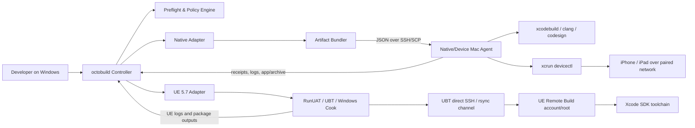
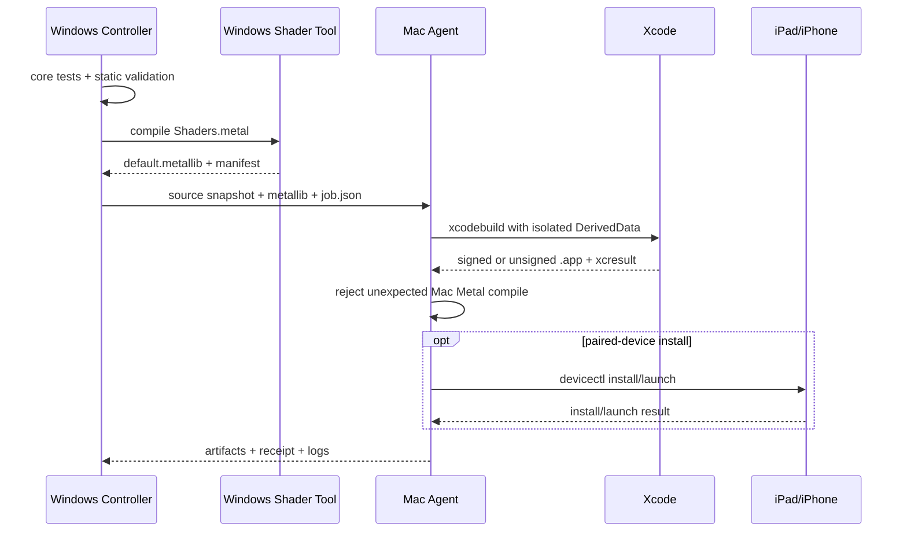

# Windows → Mac 원격 Apple 빌드 도구 설계

- 문서 상태: Proposed
- 외부 요구사항 확인일: 2026-08-18
- 대상: OctoPoly 네이티브 Metal 3D 앱, Unreal Engine 5.7 iOS/iPadOS 프로젝트
- 기준 호스트: Windows 개발 PC + SSH로 연결되는 macOS/Xcode 빌드 호스트
- 핵심 원칙: **Windows가 작업을 지휘하고, Mac은 Apple SDK 네이티브 빌드와 기기 통신 경계로 사용한다.** Native 서명은 Mac 전용으로 고정하고, UE 서명 위치는 UE 5.7 실제 프로브가 통과하기 전에는 확정하지 않는다.

## 1. 목표

하나의 Windows CLI에서 다음 두 빌드 계열을 동일한 작업 모델로 실행한다.

1. **Native Metal**
   - Windows: 저장소 검사, C++ 코어 테스트, 선택적으로 Metal 셰이더 선컴파일
   - Mac: Swift/Objective-C++/C++ 컴파일, 링크, 코드 서명, `.app` 생성, 기기 설치
2. **Unreal Engine 5.7**
   - Windows: Unreal Editor/AutomationTool, Cook, ShaderCompileWorker, Derived Data Cache, Stage/Pak/IoStore
   - Mac: Xcode SDK가 필요한 네이티브 코드 컴파일·링크와 기기 설치
   - 서명·Apple 번들 패키징: UE 5.7의 실제 UAT/UBT 프로브로 실행 프로세스와 signing 자산 위치를 먼저 동결

UE의 공식 Remote Mac Build는 Windows와 최대 두 대의 Mac을 SSH로 연결하며, 주 Mac은 Xcode가 필요한 빌드를 담당한다. Mac에는 전체 프로젝트나 Unreal Engine 설치가 필수는 아니고 Xcode가 필요하다.[1] 이 설계는 해당 경계를 재구현하지 않고, **UE 어댑터 내부에서 Epic의 Remote Mac Build를 호출·감사하는 방식**을 채택한다.

## 2. 확정 제약

### 2.1 UE 5.7의 호스트 소유권

| 작업 | Windows | Mac | 허용 여부 |
|---|---:|---:|---|
| Unreal Editor/AutomationTool 실행 | ✅ | ❌ | Windows 전용 |
| Asset Cook | ✅ | ❌ | Windows 전용 |
| ShaderCompileWorker | ✅ | ❌ | Windows 전용 |
| Metal 셰이더 컴파일 | ✅ | ❌ | Windows 전용 |
| DDC 읽기/쓰기 | ✅ | 읽기 전용 캐시 반입만 | 원본 DDC는 Windows 소유 |
| Stage, Pak, IoStore | ✅ | ❌ | Windows 전용 |
| Apple SDK 대상 C/C++/Objective-C++ 컴파일 | 요청·감사 | ✅ | Mac/Xcode 경계 |
| 링크 | 요청·감사 | ✅ | Mac/Xcode 경계 |
| Native 번들 생성·코드 서명 | 요청·감사 | ✅ | Mac/Xcode 경계 |
| UE 번들 생성·코드 서명 | 미확정 | 미확정 | §2.4 프로브 통과 전 signed profile 비활성 |
| 물리 기기 설치·실행 | SSH 요청 | ✅ | Mac이 기기와 페어링 |

Epic은 UE가 Windows에서 Metal 셰이더를 컴파일할 수 있으며, UE 5.7에는 **Metal Developer Tools for Windows 5.3**을 사용하도록 명시한다.[2] 도구는 이 버전을 선행조건으로 고정하고, 누락 또는 다른 버전이면 UE 작업을 시작하지 않는다.

### 2.2 네이티브 Metal의 셰이더 정책

네이티브 앱은 두 정책을 지원하되 프로젝트별로 하나를 고정한다.

- `xcode`: `.metal` 소스를 Xcode Sources에 두고 Mac에서 컴파일한다. 현재 저장소의 Phase 1 구조다.
- `windows-precompiled`: Windows가 `default.metallib`을 만들고 Xcode는 이를 Resource로만 복사한다. Mac 빌드 로그에 `CompileMetalFile` 또는 `MetalLink`가 나타나면 실패한다.

최종 목표 프로필은 `windows-precompiled`이다. 다만 Apple의 Windows Metal 도구 version, CLI 인자와 iOS/iPadOS 타깃 조합은 실제 설치 도구의 `--help` 출력, Xcode SDK 호환성 및 최소 셰이더 프로브로 별도 동결한다. UE 5.7용 5.3 도구가 존재한다는 이유만으로 Native 호환성이나 CLI 플래그를 추정하지 않는다.

### 2.3 Apple 서명 경계

- Native 인증서 개인 키, 프로비저닝 프로파일, Apple Account 세션은 Mac의 Xcode 실행 사용자와 그 사용자의 Keychain에만 둔다.
- Native signing 자산을 Windows로 복사하지 않는다.
- UE 5.7 signed build에는 이 규칙을 아직 적용 완료로 표시하지 않는다. Epic의 공식 provisioning 절차는 Windows의 Project Settings에서 서로 일치하는 Provisioning Profile과 Signing Certificate를 선택하는 경로를 Remote Build에도 적용한다고 설명한다.[9]
- SSH 키는 Windows OpenSSH agent/config가 소유하고 저장소나 작업 매니페스트에 넣지 않는다.
- 유료 Apple Developer Program 없이 Personal Team으로 물리 기기에 설치하도록 **문서화한 범위는 Native 앱**이며, [무료 Personal Team 무선 설치 절차](FREE_PERSONAL_TEAM_WIRELESS_INSTALL.md)를 따른다. 실제 Mac/iPad 수용 시험은 구현 차수 C의 완료 gate다.

### 2.4 UE 5.7 Signing Decision Gate

UE의 `device`와 `archive` 프로필은 다음 프로브 중 하나가 실제 Windows+Mac 환경에서 통과할 때까지 `disabled: signing-contract-unverified` 상태다.

1. **Mac-managed signing 프로브**
   - UE 5.7 modern Xcode/automatic-signing 설정으로 signed `.app` 또는 `.ipa`를 만든다.
   - UAT/UBT/iPhonePackager의 실제 signing 실행 프로세스와 host를 기록한다.
   - Windows에 private key나 export된 `.p12`가 없어도 성공함을 확인한다.
   - Mac의 동일 Xcode 사용자 Keychain과 profile만 사용했음을 receipt로 증명한다.
2. **Epic explicit provisioning 프로브**
   - Windows UBT가 요구하는 profile/certificate 입력과 실제 signing 실행 host를 기록한다.
   - private key를 Windows에 반입해야 한다면 본 설계의 보안 경계와 충돌하므로 기본 프로필로 채택하지 않는다. 별도 보안 결정과 사용자 승인이 없으면 지원하지 않는다.

프로브가 닫히기 전에도 UE `cook-only`, Windows shader compile, unsigned/native remote compile 진단은 구현할 수 있지만, UE 기기 설치 성공을 약속하지 않는다. 프로브 결과는 엔진 patch version, Xcode version, project entitlement 집합과 함께 toolchain lock에 고정한다.

## 3. 범위와 비범위

### 범위

- Windows CLI 하나로 Native/UE 작업 생성, SSH 전송, 원격 실행, 로그 수집, 결과 다운로드
- Native unsigned simulator와 Personal Team device debug 빌드; UE signed development/archive는 §2.4 통과 후 활성화
- Mac·Xcode·SDK·페어링·서명 사전 점검
- 콘텐츠 주소 기반 작업 디렉터리와 재시도 가능한 단계
- `.app`, `.ipa`(해당 시), `.xcarchive`, `.xcresult`, 로그, 영수증 수집
- Cook/셰이더의 실제 실행 호스트 검증

### 비범위

- Apple 계정 생성, 결제, 인증서 비밀 자동 입력
- App Store Connect 업로드 및 심사 자동화
- Windows에서 Xcode 자체를 대체
- UE Remote Mac Build 프로토콜의 독자 재구현
- 범용 원격 데스크톱
- 프로젝트 소스와 서명 자산을 장기간 Mac에 미러링하는 상주 서비스

## 4. 도구 이름과 기술 선택

작업명은 임시로 `octobuild`라 한다.

### Windows Controller

- 구현: .NET 8 C# single-file CLI
- 이유:
  - Windows에서 배포가 단순하고 PowerShell/batch quoting 문제를 줄인다.
  - 프로세스, JSON, SHA-256, 취소, 동시성, 로그 스트리밍을 표준 라이브러리로 처리한다.
  - `ssh.exe`, `scp.exe`, `git.exe`, Unreal `RunUAT.bat`를 직접 호출한다.

### Mac Agent

- 구현: 저장소에 버전 고정된 POSIX shell + 작은 Python 3 JSON 도우미
- 상주 데몬 없음
- Windows가 작업마다 에이전트 버전을 확인하고 필요 시 업로드
- **Native build와 device install 채널만** JSON 파일로 받고, 쉘 명령 문자열 연결 대신 허용된 명령 enum과 인자 배열로 실행
- UE Remote Build는 UBT가 직접 SSH/전송 명령을 실행하는 별도 채널이며 이 Agent를 통과하지 않는다.

## 5. 구성 요소



Mac에는 서로 섞지 않는 두 신뢰 경계가 있다.

1. **Native/Device Agent 채널:** schema-validated JSON enum, job root 제한, Native Xcode build와 `devicectl` 담당.
2. **UBT Direct Remote Build 채널:** Epic UBT가 `/bin/sh`, SSH, `rsync`와 Apple toolchain을 직접 호출한다. 전용 SSH key, 별도 비관리자 `ue-builder` 계정, 별도 remote root와 TTL cleanup을 사용하며 Agent enum으로 보호된다고 주장하지 않는다.

### 5.1 Policy Engine

프로필을 읽어 다음 불변식을 작업 시작 전에 결정한다.

- `engine`: `native` 또는 `ue5.7`
- `mode`: `build`, `signing-probe`
- `platform`: `ios` 또는 `ipados`
- `target`: `simulator`, `device`, `archive`
- `signing`: `none`, `personal-team`, `development`, `distribution`
- `signingContract`: `not-required`, `native-mac`, `unverified-disabled`, 또는 프로브로 동결된 contract ID
- `shaderOwner`: `windows` 또는 `mac`
- `cookOwner`: UE에서는 반드시 `windows`
- `install`: `none`, `paired-device`

UE 작업에서 `cookOwner != windows` 또는 `shaderOwner != windows`이면 매니페스트 검증 단계에서 거부한다. `signingContract == unverified-disabled`인 작업은 `mode == signing-probe`와 `install == none`만 허용하며, 일반 build·device install·archive export를 요청할 수 없다.

### 5.2 Native Adapter

현재 저장소의 다음 실제 값을 기본값으로 발견한다.

- Project: `app/OctoPolyIPad/OctoPolyIPad.xcodeproj`
- Scheme: `OctoPolyIPad`
- Deployment target: iPadOS 17+
- 현재 셰이더: `app/OctoPolyIPad/Sources/Shaders.metal`
- 현재 로더: `MTLDevice.makeDefaultLibrary()`

`windows-precompiled` 전환 시 `Shaders.metal`을 PBX Sources에서 제거하고 생성된 `default.metallib`을 PBX Resources에 추가해야 한다. 런타임 로더는 기본 라이브러리를 유지할 수 있으나, 실제 기기에서 함수 `vertex_main`과 `fragment_main` 로딩을 검증해야 한다.

### 5.3 UE 5.7 Adapter

- 기본 프로필은 Windows에서 단일 `RunUAT.bat BuildCookRun`을 호출하고, 공식 단계 순서인 **Build → Cook → Stage → Package → Deploy → Run**을 그대로 이벤트 모델에 반영한다.[10]
- iOS native Build 단계의 UBT Remote Mac 접속은 Windows Cook보다 먼저 일어날 수 있다. 따라서 “Cook 실패 시 Mac 미접속”을 보장하지 않는다.
- Mac 접속 전에 Cook을 끝내는 선택 프로필은 `cook-only`와 후속 build/stage/package 호출을 분리하고, UE 5.7 `-Help`와 실제 산출물 프로브로 검증된 인자 집합이 있을 때만 활성화한다. 플래그를 추정하지 않는다.
- UBT의 공식 Remote Mac 설정을 사용한다.
- `RemoteServerName`, `RemoteUserName`, SSH 키 경로, 프로젝트 signing 설정은 UE 프로젝트 설정 또는 별도 로컬 secret config에서 읽는다.
- Primary Mac은 네이티브 컴파일·링크에 사용한다. 서명·package host는 §2.4 프로브 결과를 따른다.
- Secondary Mac은 선택 사항이며, Epic 문서의 `Prepare for Debugging` 캐시 전달 경로가 필요한 경우에만 사용한다. Secondary Mac은 빌드나 Cook을 하지 않고 기존 데이터를 받아 Xcode 디버깅을 준비한다.[1]
- 정확한 UAT 인자는 `Engine/Build/BatchFiles/RunUAT.bat ... -Help`와 프로젝트 설정에서 생성한다. 문서에 고정된 예제 플래그를 실제 계약으로 간주하지 않는다.

## 6. 작업 매니페스트

저장소에는 비밀이 없는 `octobuild.json`을 둔다. 계정·팀·기기 값은 사용자 로컬 파일 또는 환경 변수에서 오버레이한다.

```json
{
  "schemaVersion": 1,
  "project": "octopoly-ipad",
  "profiles": {
    "native-ipad-device": {
      "engine": "native",
      "mode": "build",
      "platform": "ipados",
      "target": "device",
      "configuration": "Debug",
      "shaderOwner": "windows",
      "signing": "personal-team",
      "signingContract": "native-mac",
      "install": "paired-device"
    },
    "ue57-ios-signing-probe": {
      "engine": "ue5.7",
      "mode": "signing-probe",
      "platform": "ios",
      "target": "device",
      "configuration": "Development",
      "cookOwner": "windows",
      "shaderOwner": "windows",
      "signing": "development",
      "signingContract": "unverified-disabled",
      "install": "none"
    }
  }
}
```

사용자 로컬 설정 예:

```json
{
  "macHost": "octopoly-build-mac",
  "macUser": "the-same-user-configured-in-xcode",
  "ueRemoteMacUser": "ue-builder",
  "developmentTeam": "LOCAL_TEAM_ID",
  "deviceId": "LOCAL_DEVICE_IDENTIFIER"
}
```

로컬 설정은 `.gitignore` 대상이며 로그에 원문을 남기지 않는다.

## 7. 공통 작업 envelope와 엔진별 단계

각 작업은 immutable `jobId`와 SHA-256 입력 해시를 갖는다.

```text
jobId = UTC timestamp + short input hash
inputHash = hash(source snapshot + manifest + toolchain lock + generated artifacts)
remoteRoot = ~/.octobuild/jobs/<jobId>/
```

공통 envelope는 다음 순서다.

1. `resolve`: 구성 병합, 비밀 값 존재 여부만 확인
2. `doctor`: Windows/Mac/SSH/Xcode/UE/Metal 도구와 signing gate 점검
3. `execute-engine-pipeline`: 아래 엔진별 실제 순서 실행
4. `verify`: 산출물·서명·호스트 소유권과 evidence level 검사
5. `install`: signed profile이 활성화된 경우에만 페어링 기기에 설치·실행
6. `collect`: 결과와 영수증을 Windows로 회수
7. `cleanup`: 성공 시 정책에 따라 원격 중간 산출물 정리

Native의 `execute-engine-pipeline`은 `prepare → bundle → upload → xcode` 순서다. UE 기본 프로필은 단일 UAT 안에서 `Build(remote Mac 접속 가능) → Cook(Windows) → Stage(Windows) → Package(signing gate에 따라 host 기록)` 순서다.[10] 두 엔진의 단계를 하나의 거짓 선형 순서로 합치지 않는다.

각 단계는 `state.json`에 완료 영수증을 남긴다. 동일 `inputHash` 재시도 시 완료된 순수 단계를 재사용하고, 서명과 설치 단계는 다시 검증한다.

## 8. Native Metal 흐름



### Native 입력 계약

- Git commit SHA 또는 명시적 workspace snapshot
- Xcode project/workspace와 shared scheme
- Windows에서 생성한 `default.metallib`
- `shader-manifest.json`
  - 원본 `.metal` 파일 해시
  - compiler executable hash/version
  - target profile
  - output hash
- signing profile selector; 실제 인증서/프로파일은 포함하지 않음

### Native 출력 계약

- `OctoPolyIPad.app`
- 선택적으로 `.xcarchive`
- `.xcresult`
- `build.log`
- `receipt.json`
- 설치를 요청한 경우 `install-receipt.json`

## 9. UE 5.7 흐름

```mermaid
sequenceDiagram
    participant W as Windows Controller
    participant UE as UE 5.7/UAT
    participant SCW as ShaderCompileWorker Windows
    participant M as Primary Mac via UE Remote Build
    participant X as Xcode Toolchain
    participant I as iPad/iPhone

    W->>UE: BuildCookRun request
    UE->>M: Build stage via UBT direct SSH/rsync
    M->>X: native compile + link
    X-->>M: native build outputs
    M-->>UE: remote build outputs
    UE->>SCW: Cook stage compiles iOS Metal shaders
    SCW-->>UE: shader artifacts / DDC
    UE->>UE: Cook + Stage + Pak/IoStore on Windows
    UE->>UE: Package; record actual host/process/signing inputs
    UE-->>W: package outputs + complete UAT logs
    W->>W: host-boundary audit
    opt signing decision gate passed
        W->>M: install signed app over SSH
        M->>I: devicectl install/launch
    end
```

### UE 호스트 경계 감사

UE 작업 성공 조건은 패키지 생성만이 아니다.

1. Windows 로그에 Cook 시작·종료와 ShaderCompileWorker 실행 증거가 있다.
2. Windows Metal Developer Tools 버전이 5.3으로 기록된다.[2]
3. Mac UBT 채널에는 `/bin/sh`, SSH, `rsync`, Apple clang/linker와 UBT가 생성한 remote script 실행이 정상 경로임을 인정하고, Native Agent enum과 별도 정책으로 감사한다.
4. 단순 주기적 process sampling은 진단 자료일 뿐 “실행되지 않음”의 증거로 사용하지 않는다.
5. strict 프로필은 사전에 검증된 exec-audit backend로 Mac의 작업 시간대 모든 process-exec 이벤트를 수집해야 한다. 짧은 `metal`/`metallib` 실행도 기록할 수 없는 환경에서는 host-boundary 결과를 `unverified`로 처리하고 작업을 성공으로 마감하지 않는다.
6. exec trace에서 UE Cook, ShaderCompileWorker, `metal` 또는 `metallib`이 Mac에서 실행되면 실패한다. Apple clang/linker, `/bin/sh`, `rsync`, bundle 도구, 그리고 §2.4에서 동결된 signing 프로세스만 허용한다.
7. Cook manifest와 최종 번들의 staged content manifest를 대조한다.
8. Package와 signing의 실행 host, process, profile/certificate 위치를 receipt에 기록하고 §2.4 계약과 대조한다.

감사는 `events.ndjson`, UAT/UBT 원본 로그, Mac exec trace, 전후 remote-root manifest를 함께 보존한다. exec-audit backend 설치가 관리자 권한이나 상주 시스템 구성을 요구하면 이를 Mac bootstrap의 명시적 운영 선행조건으로 두며 작업 중 임의로 권한을 상승시키지 않는다.

## 10. CLI 계약

```powershell
# 공통 점검
octobuild doctor --profile native-ipad-device
octobuild doctor --profile ue57-ios-signing-probe

# 네이티브 빌드
octobuild build --profile native-ipad-device

# UE BuildCookRun host/signing audit; install remains disabled until §2.4 passes
octobuild probe-signing --profile ue57-ios-signing-probe

# 이미 성공한 작업 설치
octobuild install --job <job-id> --device <device-id>

# 결과 확인
octobuild status --job <job-id>
octobuild artifacts --job <job-id>

# 실패 단계부터 재시도
octobuild retry --job <job-id>
```

### 종료 코드

| 코드 | 의미 |
|---:|---|
| 0 | 모든 요청 단계 성공 및 검증 완료 |
| 10 | 로컬 사전 점검 실패 |
| 20 | SSH/전송 실패 |
| 30 | Windows prepare/Cook/shader 실패 |
| 40 | Mac Xcode 빌드 실패 |
| 41 | 서명/프로비저닝 실패 |
| 50 | 산출물 또는 호스트 경계 검증 실패 |
| 60 | 기기 발견/설치/실행 실패 |
| 70 | 취소됨 |

## 11. Native/Device Mac Agent 명령

Native/Device Mac Agent는 임의 쉘을 받지 않고 다음 enum만 허용한다. UE의 UBT Direct Remote Build 채널에는 이 목록을 적용하지 않는다.

- `probeHost`
- `verifyBundle`
- `xcodeBuild`
- `xcodeArchive`
- `verifyCodeSignature`
- `listDevices`
- `installApp`
- `launchApp`
- `collectArtifacts`
- `cleanupJob`

`xcodeBuild` 요청은 project/workspace, scheme, configuration, destination, derived-data path, signing mode만 허용한다. 경로는 작업 root 아래로 canonicalize하고 탈출(`..`, symlink escape)을 거부한다.

## 12. 사전 점검

### Windows

- Windows OpenSSH `ssh.exe`, `scp.exe`
- Git 및 깨끗한 source snapshot 정책
- .NET 8 runtime 또는 self-contained binary
- Native: C++ 검사 도구, Apple Metal Developer Tools for Windows
- UE: 정확한 UE 5.7 설치, AutomationTool/UBT, Windows Metal Developer Tools 5.3, 프로젝트가 요구하는 Visual Studio toolchain
- UE Remote Mac Build가 요구하는 Windows Apple device support 구성요소
- UE signed profile을 요청할 경우 §2.4 signing contract 상태와 Windows가 참조하는 profile/certificate selector
- 충분한 Cook/DDC/Stage 디스크 공간

### Mac

- macOS 및 Xcode 버전
- `id -un`으로 확인한 SSH 사용자와 Xcode UI에서 Apple Account/Team을 설정한 사용자가 Native signed job에서 동일함
- `xcode-select -p`
- `xcodebuild -version`
- `xcodebuild -showsdks`
- `security find-identity -v -p codesigning`에서 요청 profile에 필요한 identity가 현재 사용자에게 보임
- 첫 실행 라이선스·필수 컴포넌트 완료 여부
- SSH Remote Login
- 작업 root 쓰기 권한
- Native signed profile은 비대화식 SSH 세션에서 작은 signed probe target을 실제 빌드해 Keychain과 provisioning 접근을 확인함
- Keychain이 잠겼다면 password를 명령행으로 넘기거나 자동 unlock하지 않고 doctor 실패로 종료함
- UBT Direct 채널은 별도 `ue-builder` 사용자·key·remote root를 사용하며 signing 자산이 필요하다면 §2.4 계약에 그 위치와 접근 방식을 기록함
- 설치 시 `xcrun devicectl list devices`에서 기기 발견

Xcode 입력은 한 명령으로 추정하지 않는다. project/workspace 후보는 manifest와 source snapshot에서 열거하고, `xcodebuild -list`로 scheme/target, `xcodebuild -showdestinations`로 destination, 선택한 scheme의 `xcodebuild -showBuildSettings`로 team·bundle identifier·build product 경로를 각각 발견한다.

## 13. 서명 및 산출물 프로필

| 프로필 | 목적 | 서명 | 결과 |
|---|---|---|---|
| simulator-debug | 빠른 UI/렌더 검증 | 없음 | unsigned simulator `.app` |
| native-personal-device-debug | Native 개인 기기 테스트 | Personal Team automatic signing | 7일 수명의 development `.app` |
| native-paid-development | Native 등록 기기 개발 | Development | signed `.app`/`.ipa` |
| native-archive | Native TestFlight/App Store 준비 | Distribution | `.xcarchive` + exported `.ipa` |
| ue57-signed-device/archive | UE 기기/배포 | §2.4 통과 전 비활성 | signing probe receipt가 계약을 동결한 뒤 정의 |

Personal Team은 배포가 아니라 개인 기기 테스트다. Apple은 무료 Apple Account로 기기 테스트가 가능하지만, Personal Team App ID·기기·프로비저닝 프로파일에 7일 제한이 있고 재빌드·재설치가 필요할 수 있다고 명시한다.[3]

## 14. 무선 기기 설치 경계

```text
Windows ──SSH──> Mac ──Xcode/CoreDevice pairing over LAN──> iPhone/iPad
```

Windows는 iPhone/iPad에 직접 설치하지 않는다. Mac이 기기와 페어링되고 같은 네트워크에서 보이는 상태에서 Windows가 SSH로 Mac의 `devicectl`을 호출한다. 최초 iOS/iPadOS 무선 페어링은 Xcode Devices and Simulators에서 케이블 연결 후 `Connect via network`를 켜는 절차가 필요하다.[6]

## 15. 보안 설계

- SSH host key 검증은 `StrictHostKeyChecking=yes`; TOFU를 자동 승인하지 않는다.
- Native signed job은 Xcode UI 설정과 동일한 macOS 사용자를 사용한다. 가능하면 비관리자로 운영하되, 별도 계정을 원하면 그 계정으로 Xcode 로그인·Team 선택·최초 signed probe까지 다시 수행한다.
- UBT Direct 채널은 Native Agent와 다른 비관리자 `ue-builder` 계정·SSH key·remote root를 사용한다.
- `authorized_keys`는 가능하면 source IP 제한과 전용 키를 사용한다.
- 저장소, 매니페스트, 로그에 암호·Apple Account 세션·개인 키를 넣지 않는다.
- Native/Device Agent 요청은 JSON schema 검증 후 인자 배열로 실행한다. UBT Direct 채널은 Epic이 생성한 remote scripts를 실행하므로 별도 계정·root·exec trace 정책을 적용한다.
- 작업 디렉터리는 `0700`, 산출물은 최소 권한으로 생성한다.
- 서명 명령에 `-allowProvisioningUpdates`가 필요한 프로필은 명시적 opt-in이다.
- 다운로드한 산출물은 Mac receipt의 SHA-256과 Windows 재계산 값을 비교한다.
- 로그는 사용자명, 절대 홈 경로, 팀/기기 ID를 토큰화한다.

## 16. 동시성·캐시·정리

- Mac의 동일 scheme+configuration+signing identity 조합은 파일 lock으로 직렬화한다.
- 서로 다른 unsigned simulator 작업은 리소스 한도 내 병렬 실행할 수 있다.
- Native DerivedData는 `inputHash`별로 격리한다.
- UE Cook/DDC는 Windows 소유 shared cache를 사용하되 stage 디렉터리는 job별로 격리한다.
- Native Agent job root와 UBT remote root는 서로 다른 계정 아래에 두고 cleanup owner를 섞지 않는다.
- 성공 작업은 receipt와 최종 산출물을 보존하고 중간 파일은 TTL로 정리한다.
- 실패 작업은 진단을 위해 제한 기간 보존한다.
- cleanup은 현재 작업 root 밖을 삭제할 수 없다.

## 17. 관측성과 영수증

`receipt.json` 최소 필드:

```json
{
  "schemaVersion": 1,
  "jobId": "20260818T120000Z-a1b2c3d4",
  "engine": "native",
  "profile": "native-ipad-device",
  "sourceRevision": "git-sha-or-workspace-hash",
  "windowsToolchain": {},
  "macToolchain": {},
  "hostOwnership": {
    "cook": "windows",
    "shaderCompile": "windows",
    "xcodeBuild": "mac",
    "sign": "contract-probe-result"
  },
  "evidenceLevel": "strict-or-unverified",
  "artifacts": [],
  "verification": {},
  "startedAt": "RFC3339",
  "finishedAt": "RFC3339"
}
```

최종 성공 메시지는 다음을 모두 포함해야 한다.

- source revision/input hash
- Windows Cook·셰이더 완료 여부
- Native는 Mac Xcode build·sign 완료 여부, UE는 package/signing contract host와 gate 결과
- 앱/아카이브 경로와 해시
- 설치 대상과 설치·launch 확인 여부
- 재프로비저닝 만료 관련 경고

## 18. 실패 처리

| 실패 | 자동 처리 | 사람 개입 |
|---|---|---|
| SSH 단절 | 동일 단계 제한 재시도 | host key 변경 시 즉시 중단 |
| 부분 업로드 | 임시 파일 폐기 후 hash 기반 재전송 | 없음 |
| Cook/Shader 실패 | Windows 로그 보존, Package/Install 미실행. 단일 BuildCookRun에서는 선행 UBT Remote Build가 이미 실행됐을 수 있음 | 프로젝트 수정 필요 |
| Xcode compile/link 실패 | xcresult 회수 | Xcode/SDK/소스 수정 |
| signing 실패 | 재시도 안 함 | §2.4 receipt가 지목한 host의 계정·identity·profile/certificate selector 확인 |
| 기기 offline | 빌드 성공은 보존, install만 실패 | 기기 깨우기/네트워크/재페어링 |
| Mac shader 실행 감지 | 산출물 격리, 작업 실패 | 경계 설정 수정 |
| receipt hash 불일치 | 산출물 폐기 | 전송/디스크 조사 |

## 19. 현재 저장소와의 차이

현재 Phase 1 저장소에는 단순 SSH `xcodebuild` 스크립트와 Mac 로컬 `devicectl` 설치 스크립트가 있다. 새 설계 구현 시 다음 차이를 닫아야 한다.

| 현재 | 목표 | 구현 소유자 |
|---|---|---|
| Mac에 이미 동기화된 checkout 필요 | job별 immutable source bundle | Controller/Bundler |
| 환경 변수와 쉘 문자열 중심 | schema 검증 JSON 요청 | Controller/Mac Agent |
| `Shaders.metal`을 Xcode Sources에서 컴파일 | Windows `default.metallib` + Resources | Native Adapter/Xcode project |
| 원격 build 결과를 회수하지 않음 | app/xcresult/log/receipt 다운로드 | Collector |
| 성공 여부가 exit code 중심 | hash·서명·host-boundary 검증 | Verifier |
| 수동 install만 제공 | paired device discovery/install/launch 영수증 | Device Adapter |
| UE 어댑터 없음 | UAT + 별도 UBT Direct SSH 신뢰 경계 | UE Adapter/Security owner |
| macOS CI 템플릿이 Mac에서 `.metal`을 컴파일 | strict 프로필용 선컴파일 artifact 소비 | CI owner |

문서만 추가하는 현재 변경은 이 차이를 구현한 것으로 간주하지 않는다.

## 20. 구현 차수

### 차수 A — 프로토콜과 Doctor

- C# CLI skeleton
- manifest/local overlay schema
- SSH host verification
- Mac probe agent
- Xcode/SDK/signing/device doctor
- receipt schema와 redaction

**완료 조건:** 실제 Windows→Mac SSH에서 `doctor` 영수증 회수.

### 차수 B — Native unsigned simulator

- source bundle
- isolated DerivedData
- unsigned simulator `xcodebuild`
- `.app`, `.xcresult`, log 회수

**완료 조건:** Mac에서 실제 simulator build 성공 및 Windows artifact hash 일치.

### 차수 C — Native Windows Metal + device

- Native Metal 도구 version/CLI probe와 최소 golden shader
- `default.metallib` build/manifest
- Xcode project resource 전환
- Mac Metal compile 금지 gate
- Personal Team 무선 install/launch

**완료 조건:** Mac build log에 Metal compile 단계가 없고, 실제 iPad에서 설치·launch 확인.

### 차수 D — UE 5.7

- Windows toolchain/Metal 5.3 doctor
- UAT/UBT Remote Mac integration
- Native Agent와 분리된 UBT Direct SSH 계정·key·remote root
- 단일 BuildCookRun의 실제 Build→Cook→Stage→Package 이벤트 매핑
- Cook/shader host audit
- strict exec-audit backend
- §2.4 signing decision probe와 contract receipt
- package artifact/receipt 수집

**완료 조건:** Cook·ShaderCompileWorker는 Windows에서만 실행됐다는 strict 증거, Mac native compile/link 증거, 실제 package/sign host와 signing input 계약이 있다. signed profile은 이 계약이 통과한 경우에만 실제 기기 launch까지 검증한다.

### 차수 E — Archive·운영 안정화

- archive/export profile
- retries/cache/TTL cleanup
- multiple Mac scheduling
- metrics and support bundle

**완료 조건:** 실패 주입 테스트와 재시도·정리·해시 검증 통과.

## 21. 수용 기준

### 공통

- [ ] Windows 한 명령으로 작업 생성부터 결과 회수까지 완료된다.
- [ ] host key, Xcode, scheme, destination, signing, device가 build 전에 검증된다.
- [ ] 비밀이 source bundle, manifest, log, artifact에 포함되지 않는다.
- [ ] 모든 artifact가 SHA-256과 생산 host를 가진다.
- [ ] build 성공과 install/launch 성공을 별도 상태로 보고한다.

### Native

- [ ] portable core 검사가 Windows에서 먼저 통과한다.
- [ ] strict 프로필은 Windows에서 `default.metallib`을 생성한다.
- [ ] strict 프로필의 Mac 로그에 Metal compile/link 단계가 없다.
- [ ] Xcode가 signed device `.app`을 생성한다.
- [ ] 현재 OctoPoly target은 실제 iPad에서 install과 launch를 확인한다. iPhone은 별도 target/profile 수용 시험으로 다룬다.

### UE 5.7

- [ ] Windows Metal Developer Tools 5.3을 확인한다.
- [ ] Cook·ShaderCompileWorker·Stage/Pak/IoStore는 Windows에서 실행된다.
- [ ] Mac에 Unreal Editor/Engine 설치를 요구하지 않는다.
- [ ] UBT Direct SSH 채널은 Native Agent와 다른 계정·key·remote root를 사용한다.
- [ ] strict exec trace로 Mac에서 Cook·ShaderCompileWorker·Metal shader compiler 실행이 없음을 확인한다.
- [ ] Mac은 Xcode SDK 네이티브 compile/link를 수행하고, package/sign host는 §2.4 receipt와 일치한다.
- [ ] Windows가 참조하는 profile/certificate selector와 실제 signing 자산 위치가 §2.4 계약에 기록된다.
- [ ] signing contract가 통과한 프로필만 최종 앱을 실제 iOS/iPadOS 기기에 설치·launch한다.

## 22. 결정 기록

1. **UE Remote Build 재구현 금지:** Epic 공식 UBT 경로를 사용해 엔진 버전별 세부 동작을 위임한다.
2. **Native Agent와 UBT 채널 분리:** Native/device는 versioned one-shot Agent를 사용하고, UBT의 직접 shell/rsync 채널은 별도 계정·key·root로 격리한다.
3. **Windows가 source of truth:** Cook, DDC, staged content, shader artifact는 Windows 영수증이 기준이다.
4. **Native 서명은 Mac 전용, UE 서명은 gated:** UE 5.7 signed 프로필은 실제 signing 계약이 동결되기 전 비활성이다.
5. **검증 없는 성공 금지:** package exit code만으로 완료 처리하지 않고 host boundary, signature, hash, 선택적 device launch를 확인한다.
6. **프로필별 shader 정책:** UE 5.7은 Windows 고정, Native는 migration 기간을 명시하되 최종 strict 프로필은 Windows 고정이다.
7. **UAT 순서 왜곡 금지:** 기본 UE 프로필은 Build→Cook→Stage→Package 순서를 보고하며, Cook 실패 전에 Remote Build가 이미 실행될 수 있음을 숨기지 않는다.

## Sources

[1] https://dev.epicgames.com/documentation/en-us/unreal-engine/creating-remote-builds-of-unreal-engine-projects-for-ios?application_version=5.7
[2] https://dev.epicgames.com/documentation/en-us/unreal-engine/using-the-windows-metal-shader-compiler-for-ios-in-unreal-engine?application_version=5.7
[3] https://developer.apple.com/support/compare-memberships
[6] https://help.apple.com/xcode/mac/current/en.lproj/devbc48d1bad.html
[9] https://dev.epicgames.com/documentation/en-us/unreal-engine/setting-up-ios-tvos-and-ipados-provisioning-profiles-and-signing-certificates-for-unreal-engine-projects?application_version=5.7
[10] https://dev.epicgames.com/documentation/en-us/unreal-engine/build-operations-cooking-packaging-deploying-and-running-projects-in-unreal-engine?application_version=5.7
